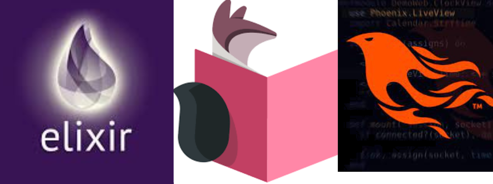

# Functional Elixir

A repository demonstracting knowledge and application of basic Elixir commands following the [freeCodeCamp.org](https://www.freecodecamp.org/) [Functional Programming with Elixir](https://youtu.be/IiIgm_yaoOA) youtube video by [Anil Kulkarni](https://github.com/evolutionengine).

# Elixir LiveBook

Livebook is an open-source tool for writing interactive code notebooks in Elixir. It's part of a growing collection of Elixir tools for numerical computing, data science, and Machine Learning.

# Visual Studio Code

Visual Studio Code is used to write the codes as well. Through the use of the ElixirLS plugin. OTP25 Erlang, Elixir 1.15.2 compatible with ElixirLS. The `iex> h` command is used for the inbuilt command help within the elixir language.  

## Topics Covered:

1. Introduction to Functional Programming
2. Introduction to Elixir
3. Installation & Set Up
4. Introduction to Recursion
5. Notebooks -
   1. Match Operator
   2. Pattern Matching
   3. Data Types - Tuple, Atom, List, Map, Struct
   4. Flow Control - Recursion, for, cond, case, with
6. Introduction to Mix
7. Mix - Tutorials
8. Mix - Stats Project
9. Conclusion
10. Final Words

# Phoenix LiveView

Phoenix Liveview is used to construct a demo website and button counter.  
